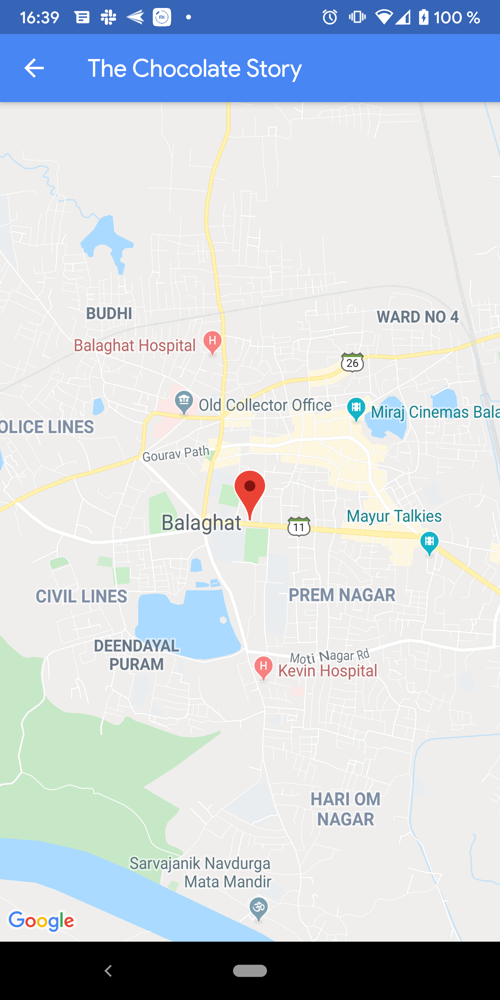
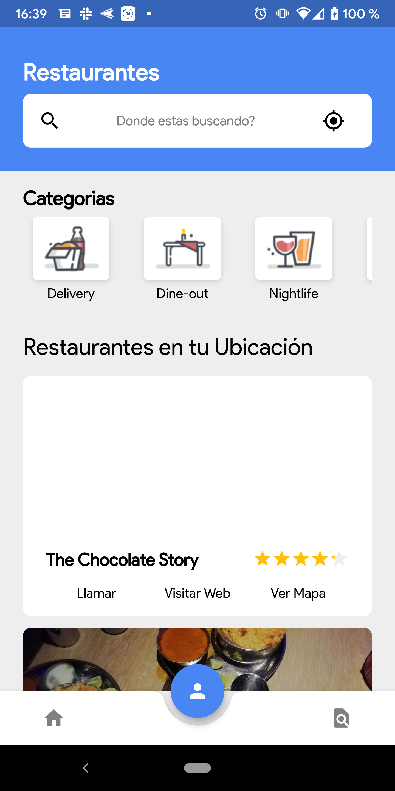
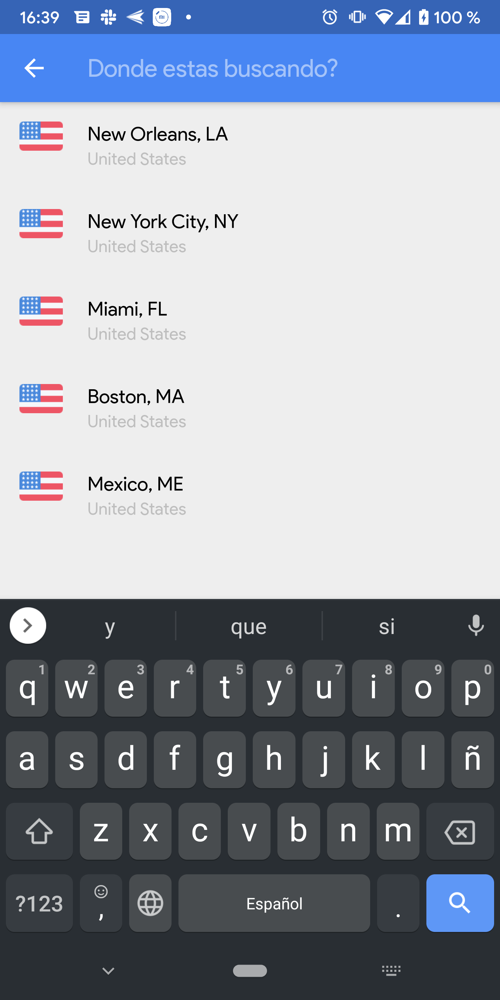
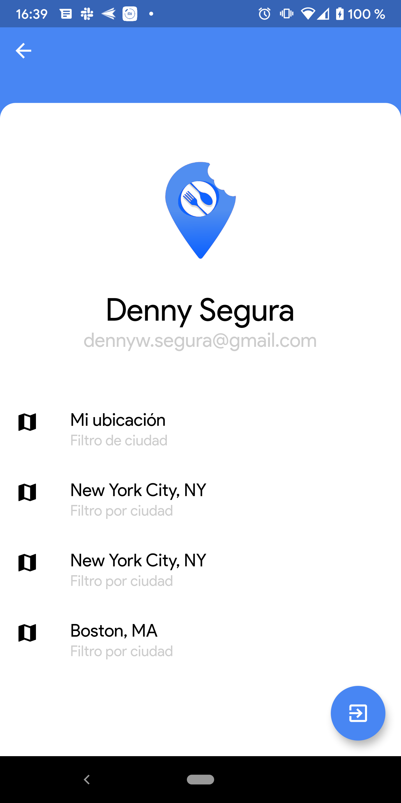
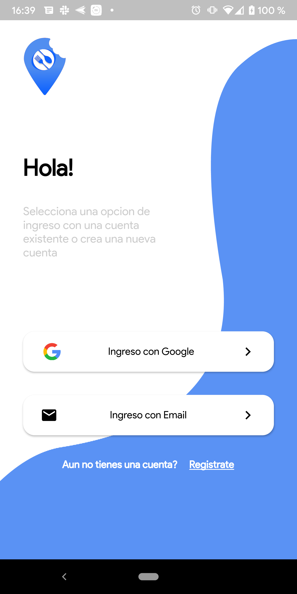
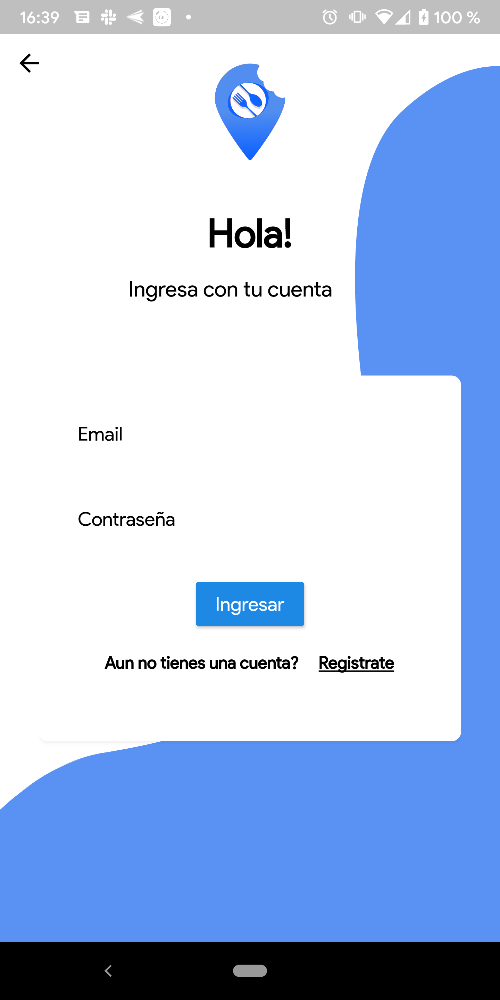
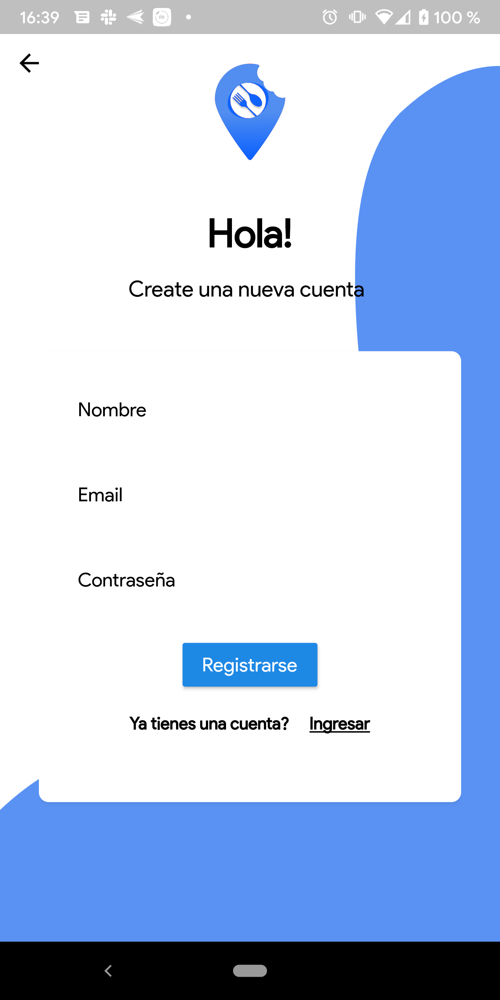
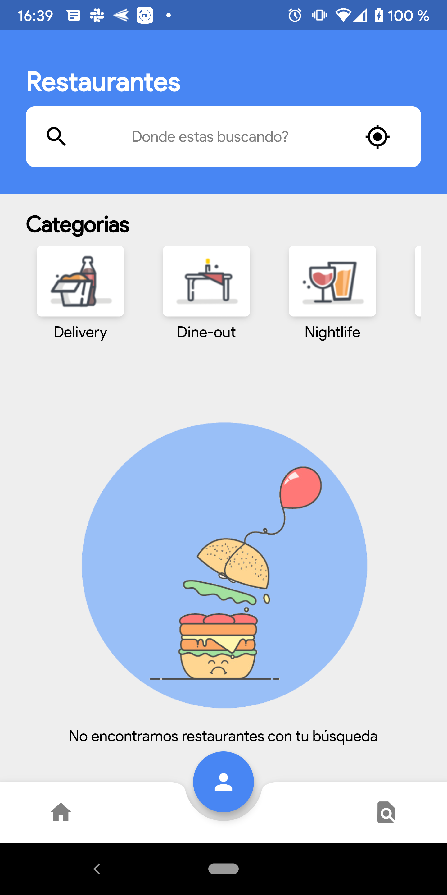

# tyba_front_test

Prueba tecnica fron tyba

<div style="display:flex;flex-direction:row;justify-content: space-between">
    
    
    
    
</div>

<div style="display:flex;flex-direction:row;justify-content: space-between">
    
    
    
    
</div>

## Api public

[Zomato](https://developers.zomato.com/documentation?lang=es_cl#!/restaurant/search)
  

## Installation

    $ clone this repo
    $ Install flutter dependencies
    $ flutter run -t [target-main] --flavor [target-flavor]

### Flavors available (target-flavor)

 - development
 - production

### Main file available (target-main)

 - lib/main_development.dart
 - lib/main_production.dart

 ## Debugger config

 Vscode config

 ```json
 {
    "version": "0.2.0",
    "configurations": [
        {
            "name": "development",
            "request": "launch",
            "type": "dart",
            "program": "lib/main_dev.dart",
            "args": [
                "--flavor",
                "development"
              ]
        },
        {
            "name": "release",
            "request": "launch",
            "type": "dart",
            "program": "lib/main_release.dart",
            "args": [
                "--flavor",
                "production"
              ]
        }
    ]
}
```

Thanks
------

**Denny Segura** © 2019+<br>

> GitHub [@devdennysegura](https://github.com/devdennysegura) &nbsp;&middot;&nbsp;
> Twitter [@dennysegura3](https://twitter.com/dennysegura3)